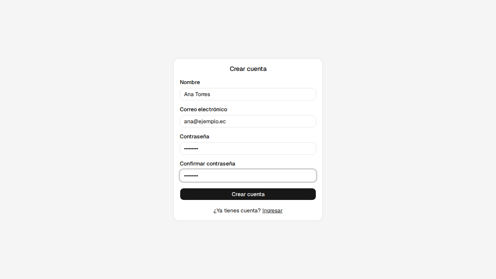
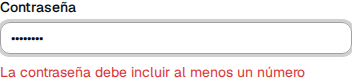
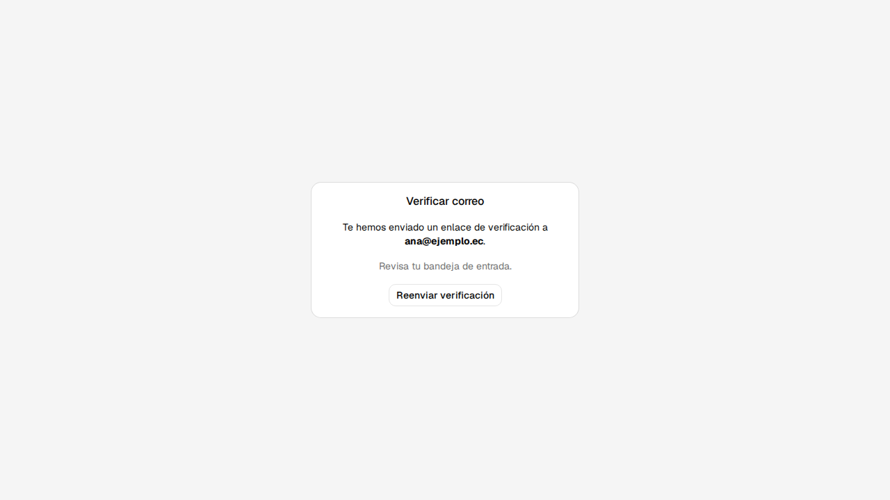
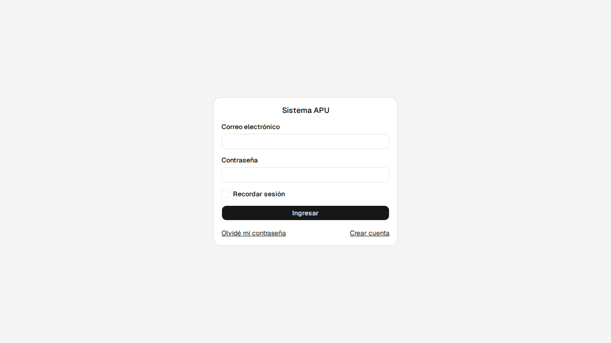
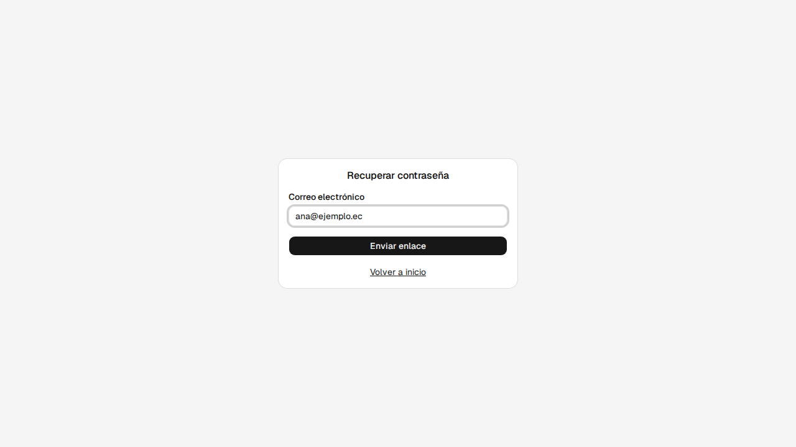
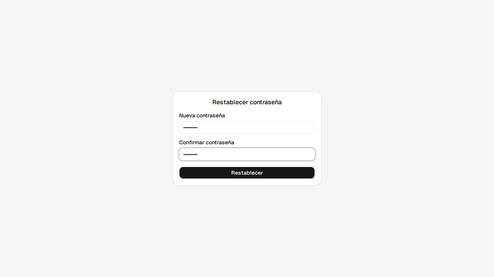
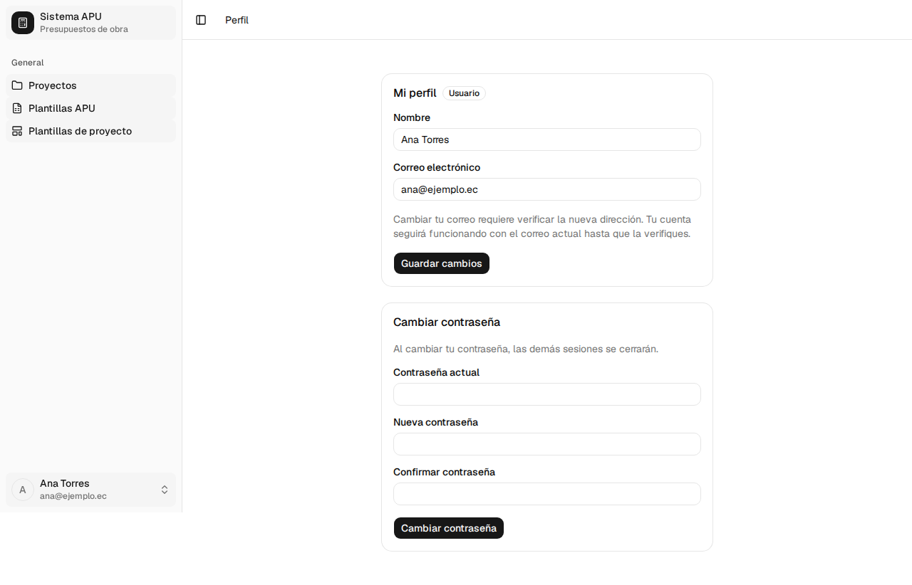
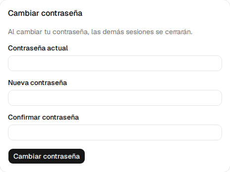

# 1. Cuenta y acceso

Este capítulo cubre cómo crear una cuenta, verificarla, iniciar sesión, recuperar o cambiar tu
contraseña, y editar tu perfil. Es lo único que puedes hacer sin sesión iniciada, y lo primero
que necesitas para llegar al resto del sistema.

Procesos cubiertos: **P-01**, **P-02**, **P-03**, **P-04**.

---

## 1.1 Crear una cuenta <!-- P-01 · S-02 -->

**Quién puede hacerlo:** cualquier visitante sin sesión iniciada.

**Antes de empezar**

- No tener ya una cuenta con el mismo correo.

**Pasos**

1. Entra en `/registro`, o pulsa **Crear cuenta** desde la pantalla de inicio de sesión (§1.3).

2. Completa el formulario y pulsa **Crear cuenta**.

   

   | Campo                | ¿Obligatorio? | Formato o valores                    | Si lo dejas vacío o es inválido  |
   | -------------------- | ------------- | ------------------------------------ | -------------------------------- |
   | Nombre               | Sí            | Texto                                | _"El nombre es obligatorio"_     |
   | Correo electrónico   | Sí            | Formato de correo                    | _"Correo electrónico inválido"_  |
   | Contraseña           | Sí            | Ver la política de contraseña, abajo | el primer requisito que incumpla |
   | Confirmar contraseña | Sí            | Igual a Contraseña                   | _"Las contraseñas no coinciden"_ |

   > **Política de contraseña.** Se exige aquí, al restablecerla (§1.5) y al cambiarla desde tu
   > perfil (§1.7):
   >
   > - Mínimo 8 caracteres → si no, _"La contraseña debe tener al menos 8 caracteres"_.
   > - Al menos una letra → si no, _"La contraseña debe incluir al menos una letra"_.
   > - Al menos un número → si no, _"La contraseña debe incluir al menos un número"_.
   >
   > Los tres requisitos se comprueban por separado: el mensaje que ves es el del primero que no
   > cumples.

   

**Si algo sale mal**

- _"El correo ya está registrado"_ (o el mensaje que envíe el servidor) aparece encima del
  formulario entero, no junto al campo que falló: el sistema no distingue cuál fue.

**Al terminar:** la cuenta queda creada, todavía sin verificar, y pasas a la pantalla **Verificar
correo** (§1.2).

---

## 1.2 Verificar tu correo <!-- P-01 · S-03 -->

**Quién puede hacerlo:** cualquier persona que acabe de registrarse.

**Antes de empezar**

- Haber creado una cuenta (§1.1).

**Pasos**

1. Al crear la cuenta llegas directo a **Verificar correo**.

   

2. Revisa tu bandeja de entrada y abre el enlace del correo. La pantalla pasa a "Verificando tu
   correo…" y, si el enlace es válido, a "¡Correo verificado exitosamente!" con un enlace **Ir a
   iniciar sesión**.

3. Si no te llega el correo, pulsa **Reenviar verificación**. Tras cada envío, el botón queda
   deshabilitado 60 segundos ("Reenviar en Ns").

**Si algo sale mal**

- _"El enlace ha expirado."_ → pulsa **Reenviar verificación** para pedir uno nuevo.

**Al terminar:** tu correo queda verificado y puedes iniciar sesión (§1.3).

---

## 1.3 Iniciar sesión <!-- P-02 · S-01 -->

**Quién puede hacerlo:** cualquier persona con una cuenta creada y el correo verificado.

**Antes de empezar**

- Tener el correo verificado (§1.2).

**Pasos**

1. Entra en `/login`.

   

   | Campo              | ¿Obligatorio? | Formato o valores | Si lo dejas vacío o es inválido  |
   | ------------------ | ------------- | ----------------- | -------------------------------- |
   | Correo electrónico | Sí            | Formato de correo | _"Correo electrónico inválido"_  |
   | Contraseña         | Sí            | Texto             | _"La contraseña es obligatoria"_ |
   | Recordar sesión    | No            | Casilla           | Sin marcar                       |

2. Pulsa **Ingresar**.

**Si algo sale mal**

- _"Correo o contraseña incorrectos"_ → uno de los dos datos no coincide. El sistema no dice
  cuál, para no revelar qué correos existen.
- _"Tu correo no ha sido verificado."_, con un enlace **Reenviar verificación** → completa primero
  §1.2.
- _"Tu cuenta ha sido desactivada. Contacta al administrador."_ → pide a un administrador que la
  reactive.

**Al terminar:** entras a **Proyectos**, o a la pantalla que intentabas abrir antes de que te
pidiera iniciar sesión.

---

## 1.4 Recuperar tu contraseña <!-- P-03 · S-04 -->

**Quién puede hacerlo:** cualquier visitante, tenga o no cuenta.

**Antes de empezar**

- Ninguna.

**Pasos**

1. Desde **Iniciar sesión**, pulsa **Olvidé mi contraseña**, o entra directamente en `/recuperar`.

2. Escribe tu correo y pulsa **Enviar enlace**.

   

   | Campo              | ¿Obligatorio? | Formato o valores | Si lo dejas vacío o es inválido |
   | ------------------ | ------------- | ----------------- | ------------------------------- |
   | Correo electrónico | Sí            | Formato de correo | _"Correo electrónico inválido"_ |

3. La pantalla siempre responde igual: _"Si el correo ingresado está registrado, recibirás un
   enlace para restablecer tu contraseña."_ Es intencional: así nadie puede usar este formulario
   para averiguar qué correos tienen cuenta.

**Si algo sale mal**

- No te llega ningún correo → revisa que escribiste bien tu dirección; el sistema no avisa si el
  correo no existe.

**Al terminar:** si la cuenta existe, te llega un correo con un enlace a **Restablecer
contraseña** (§1.5).

---

## 1.5 Restablecer tu contraseña <!-- P-03 · S-05 -->

**Quién puede hacerlo:** quien tenga el enlace del correo de recuperación.

**Antes de empezar**

- Tener el enlace del correo de recuperación (§1.4). Es de un solo uso.

**Pasos**

1. Abre el enlace del correo. Llegas a **Restablecer contraseña**.

   

   | Campo                | ¿Obligatorio? | Formato o valores                    | Si lo dejas vacío o es inválido  |
   | -------------------- | ------------- | ------------------------------------ | -------------------------------- |
   | Nueva contraseña     | Sí            | Ver la política de contraseña (§1.1) | el primer requisito que incumpla |
   | Confirmar contraseña | Sí            | Igual a Nueva contraseña             | _"Las contraseñas no coinciden"_ |

2. Pulsa **Restablecer**.

**Si algo sale mal**

- _"El enlace ha expirado."_ → pulsa **Solicitar nuevo enlace** y repite §1.4. Un enlace ya usado
  también cuenta como expirado.

**Al terminar:** _"Contraseña restablecida exitosamente."_ Pulsa **Iniciar sesión** y entra con
la nueva contraseña (§1.3).

---

## 1.6 Editar tu perfil <!-- P-04 · S-06 -->

**Quién puede hacerlo:** cualquier usuario con sesión iniciada, sobre su propio perfil.

**Antes de empezar**

- Tener la sesión iniciada (§1.3).

**Pasos**

1. Entra en **Perfil**, desde tu nombre en la esquina inferior del menú lateral.

   

   Junto a tu nombre ves tu rol (**Usuario** o **Admin**) como una etiqueta de solo lectura: no
   puedes cambiar tu propio rol desde aquí.

2. Edita **Nombre** y/o **Correo electrónico**.

   | Campo              | ¿Obligatorio? | Formato o valores | Si lo dejas vacío o es inválido |
   | ------------------ | ------------- | ----------------- | ------------------------------- |
   | Nombre             | Sí            | Texto             | _"El nombre es obligatorio"_    |
   | Correo electrónico | Sí            | Formato de correo | _"Correo electrónico inválido"_ |

   Si cambias el correo, la pantalla te avisa: _"Cambiar tu correo requiere verificar la nueva
   dirección. Tu cuenta seguirá funcionando con el correo actual hasta que la verifiques."_

3. Pulsa **Guardar cambios**.

**Al terminar:** tus datos quedan guardados. Si cambiaste el correo, sigues entrando con el
correo anterior hasta que verifiques el nuevo.

---

## 1.7 Cambiar tu contraseña <!-- P-04 · S-06 -->

**Quién puede hacerlo:** cualquier usuario con sesión iniciada, sobre su propia contraseña.

**Antes de empezar**

- Tener la sesión iniciada (§1.3) y tu contraseña actual a mano.

**Pasos**

1. En **Perfil**, busca la tarjeta **Cambiar contraseña**.

   

   | Campo                | ¿Obligatorio? | Formato o valores                    | Si lo dejas vacío o es inválido  |
   | -------------------- | ------------- | ------------------------------------ | -------------------------------- |
   | Contraseña actual    | Sí            | Texto                                | _"Ingresa tu contraseña actual"_ |
   | Nueva contraseña     | Sí            | Ver la política de contraseña (§1.1) | el primer requisito que incumpla |
   | Confirmar contraseña | Sí            | Igual a Nueva contraseña             | _"Las contraseñas no coinciden"_ |

2. Pulsa **Cambiar contraseña**.

**Al terminar:** tu contraseña queda actualizada y **tu sesión se cierra**, así que vuelves a
iniciar sesión con la nueva contraseña (§1.3).
