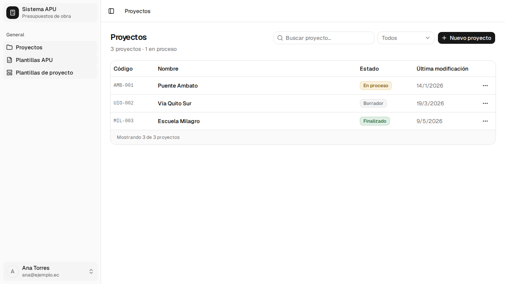
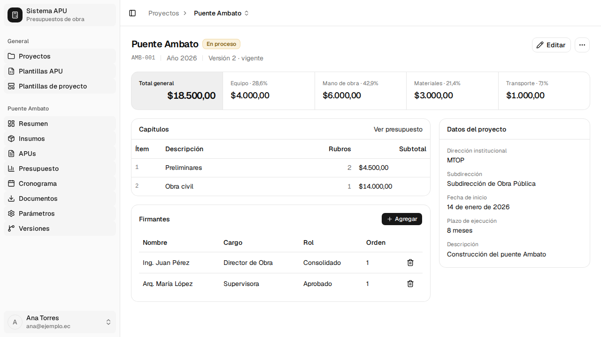
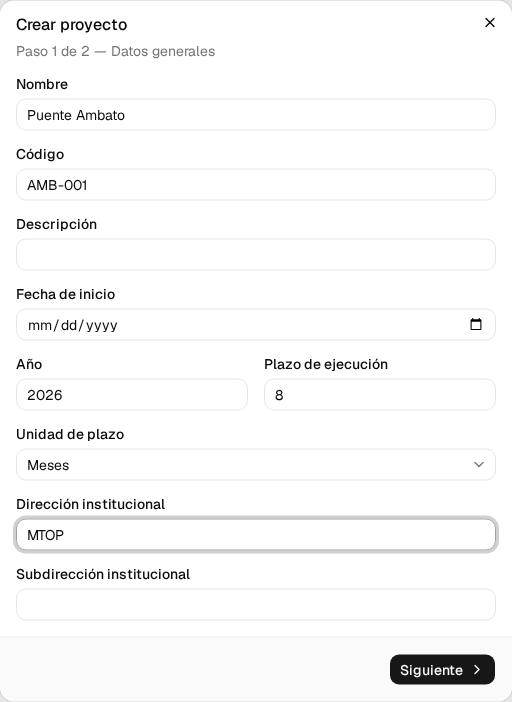
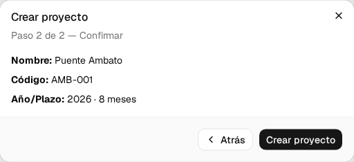
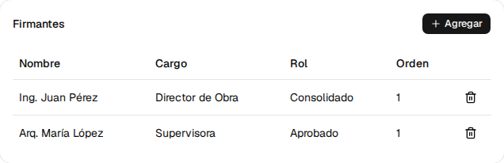
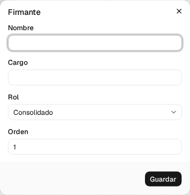
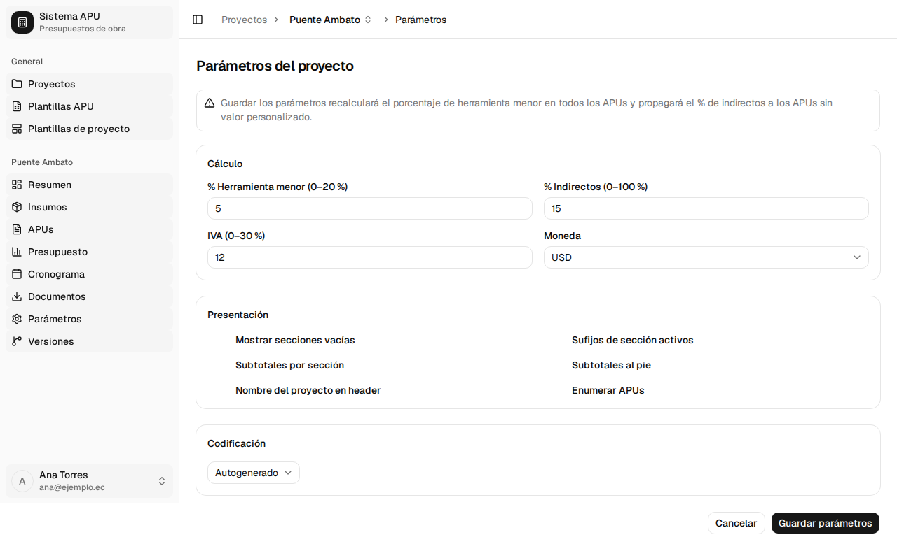
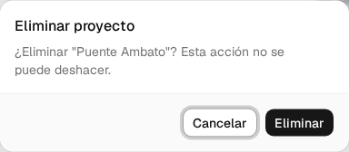

# 2. Proyectos

Un **proyecto** es el contenedor de todo tu trabajo: los insumos, los análisis de precios
unitarios (APU), el presupuesto y el cronograma viven dentro de él. Este capítulo cubre cómo
crear un proyecto, registrar quién lo firma, ajustar los parámetros con los que el sistema
calcula, y cómo eliminarlo.

Procesos cubiertos: **P-05**, **P-06**, **P-08**, **P-10**, **P-11**.

---

## 2.1 Ver y abrir tus proyectos <!-- P-05 · S-07 -->

**Quién puede hacerlo:** cualquier usuario con sesión iniciada.

**Antes de empezar**

- Tener la sesión iniciada (ver §1.2).

Solo ves **tus** proyectos. Los de otros usuarios no aparecen en la lista ni son accesibles por
su dirección web.

**Pasos**

1. Al iniciar sesión llegas directamente a **Proyectos**. También puedes volver desde
   **Proyectos** en el menú lateral.

   

   La cabecera te dice cuántos proyectos tienes y cuántos están en proceso. La tabla muestra
   **Código**, **Nombre**, **Estado** y **Última modificación**.

2. Para encontrar un proyecto entre muchos, escribe en **Buscar proyecto…** o usa el filtro
   **Filtrar por estado**, que ofrece **Todos**, **Borrador**, **En proceso** y **Finalizado**.

3. Pulsa el nombre del proyecto, o **Abrir** en el menú **⋯** de su fila, para entrar.

   

   El resumen muestra los capítulos del presupuesto de la versión vigente, el **Total general**
   y una tarjeta **Datos del proyecto** con la dirección institucional, la fecha de inicio, el
   plazo y la descripción.

**Si algo sale mal**

- _"No hay proyectos — Crea tu primer proyecto para empezar."_ → todavía no has creado ninguno.
  Continúa en §2.2.
- _"Sin resultados — Ningún proyecto coincide con la búsqueda."_ → borra el texto de búsqueda o
  pon el filtro de estado en **Todos**.

**Al terminar:** estás dentro del proyecto. El menú lateral te da acceso a Insumos, APUs,
Presupuesto, Cronograma y Documentos, y todos trabajan sobre la versión que muestra la barra
superior.

---

## 2.2 Crear un proyecto <!-- P-06 · S-08 -->

**Quién puede hacerlo:** cualquier usuario con sesión iniciada.

**Antes de empezar**

- Tener a mano el plazo de ejecución de la obra y la dirección institucional que la contrata.

**Pasos**

1. En la pantalla **Proyectos**, pulsa **Nuevo proyecto**.

   

2. **Paso 1 de 2 — Datos generales.** Completa el formulario.

   

   | Campo                      | ¿Obligatorio? | Formato o valores               | Si lo dejas vacío                           |
   | -------------------------- | ------------- | ------------------------------- | ------------------------------------------- |
   | Nombre                     | Sí            | Texto, hasta 200 caracteres     | _"El nombre es obligatorio"_ y no avanza    |
   | Código                     | No            | Texto, hasta 50 caracteres      | El sistema genera uno                       |
   | Descripción                | No            | Texto, hasta 2000 caracteres    | Se queda vacía                              |
   | Fecha de inicio            | No            | Fecha                           | Se queda vacía; la fijas después            |
   | Año                        | Sí            | Número entero entre 2000 y 2100 | _"El año es obligatorio"_ y no avanza       |
   | Plazo de ejecución         | Sí            | Número entero entre 1 y 600     | _"El plazo es obligatorio"_ y no avanza     |
   | Unidad de plazo            | Sí            | **Meses** · **Semanas**         | Viene con **Meses** puesto                  |
   | Dirección institucional    | Sí            | Texto, hasta 200 caracteres     | _"La dirección es obligatoria"_ y no avanza |
   | Subdirección institucional | No            | Texto, hasta 200 caracteres     | Se queda vacía                              |

3. Pulsa **Siguiente**. Si falta algún campo obligatorio, el asistente **no avanza** y marca en
   rojo lo que falta: los obligatorios se comprueban aquí, no al final.

4. **Paso 2 de 2 — Confirmar.** Repasa el nombre, el código y el año con el plazo.

   

   Si algo no está bien, pulsa **Atrás** y corrígelo.

5. Pulsa **Crear proyecto**.

**Si algo sale mal**

- El botón **Siguiente** no hace nada → hay un campo obligatorio sin llenar más arriba en el
  formulario; desplázate y busca el mensaje en rojo.

**Al terminar:** el proyecto queda creado con la **versión 1** del presupuesto marcada como
vigente y los parámetros de cálculo copiados de los valores por defecto del sistema. Se abre su
pantalla de resumen. Todavía no tiene insumos, ni APUs, ni capítulos, ni cronograma.

> **El proyecto nace con la base de insumos vacía.** Para llenarla, entra en **Insumos** y usa
> **Copiar base al proyecto** o la importación por archivo CSV (ver §3.5 y §3.3).

---

## 2.3 Registrar los firmantes <!-- P-08 · S-11 -->

Los firmantes son quienes **consolidan** y **aprueban** la propuesta. Salen en la carátula de los
documentos que exportes; no intervienen en ningún cálculo.

**Quién puede hacerlo:** el dueño del proyecto.

**Antes de empezar**

- Tener el proyecto abierto (§2.1).

**Pasos**

1. En el resumen del proyecto, busca la tarjeta **Firmantes**.

   

2. Pulsa **Agregar**.

   

   | Campo  | ¿Obligatorio? | Formato o valores              | Si lo dejas vacío            |
   | ------ | ------------- | ------------------------------ | ---------------------------- |
   | Nombre | Sí            | Texto, hasta 200 caracteres    | _"El nombre es obligatorio"_ |
   | Cargo  | Sí            | Texto, hasta 200 caracteres    | _"El cargo es obligatorio"_  |
   | Rol    | Sí            | **Consolidado** · **Aprobado** | —                            |
   | Orden  | Sí            | Número entero, 1 o mayor       | —                            |

3. Pulsa **Guardar**. El firmante aparece en la tabla.

4. Para quitar uno, pulsa el icono de papelera de su fila.

**Al terminar:** los firmantes quedan guardados en el proyecto y aparecerán en la carátula de los
documentos que generes desde **Documentos** (§7).

---

## 2.4 Configurar los parámetros del proyecto <!-- P-11 · S-12 -->

Aquí decides **con qué porcentajes calcula el sistema** y **cómo se ve el APU impreso**. Es la
pantalla que más conviene revisar antes de empezar a armar precios.

**Quién puede hacerlo:** el dueño del proyecto.

**Antes de empezar**

- Tener el proyecto abierto (§2.1).
- Saber qué porcentaje de costos indirectos vas a aplicar: mientras no lo configures, el resumen
  del proyecto te lo recuerda con un aviso.

**Pasos**

1. En el menú lateral del proyecto, entra en **Parámetros**.

   

2. Ajusta el grupo **Cálculo**. Los porcentajes se escriben como número, no como fracción: para
   un 5 %, escribe `5`.

   | Campo               | ¿Obligatorio? | Formato o valores                                  | Qué hace                                                                                      |
   | ------------------- | ------------- | -------------------------------------------------- | --------------------------------------------------------------------------------------------- |
   | % Herramienta menor | Sí            | Número entre 0 y el máximo que muestra la etiqueta | Recalcula la fila de Herramienta Menor de **todos** los APUs                                  |
   | % Indirectos        | No            | Número entre 0 y el máximo que muestra la etiqueta | Es el valor por defecto del proyecto: se aplica a todos los APUs que no tengan el suyo propio |
   | IVA                 | Sí            | Número entre 0 y el máximo que muestra la etiqueta | Solo referencial; no entra en el costo total del APU                                          |
   | Moneda              | Sí            | **USD**                                            | —                                                                                             |

   > Los máximos no son fijos: los define el administrador del sistema y la etiqueta de cada
   > campo te muestra el rango vigente, por ejemplo **% Herramienta menor (0–20 %)**.

3. El grupo **Presentación** son seis interruptores pensados para cambiar cómo se ve el APU:
   **Mostrar secciones vacías**, **Sufijos de sección activos**, **Subtotales por sección**,
   **Subtotales al pie**, **Nombre del proyecto en header** y **Enumerar APUs**.

   > **Todavía no cambian nada.** Su valor se guarda con el resto de parámetros, pero hoy ni la
   > pantalla del APU ni los documentos que exportas los tienen en cuenta. Puedes dejarlos como
   > vengan.

4. En **Codificación**, elige cómo se asignan los códigos de los rubros:

   | Valor        | Qué significa                         |
   | ------------ | ------------------------------------- |
   | Autogenerado | El sistema pone el código de cada APU |
   | Manual       | Tú escribes el código de cada APU     |

5. Pulsa **Guardar**.

**Si algo sale mal**

- _"Mínimo 0 %"_ o _"Máximo N %"_ → el valor está fuera del rango que permite el administrador.
  Corrígelo al rango que indica la etiqueta del campo.

**Al terminar:** los parámetros quedan guardados **solo en este proyecto**; no afectan a tus
otros proyectos. Si cambiaste el % de Herramienta Menor o el % de Indirectos, los APUs se
recalculan de inmediato.

---

## 2.5 Eliminar un proyecto <!-- P-10 · S-07 -->

**Quién puede hacerlo:** el dueño del proyecto.

**Antes de empezar**

- Asegúrate de que ya no lo necesitas: **se borra todo su contenido y no se puede recuperar** —
  versiones del presupuesto, APUs, insumos, cronograma, firmantes y parámetros.

**Pasos**

1. Abre el menú **⋯** del proyecto: en su fila de la pantalla **Proyectos**, o con **Más
   acciones** dentro del propio proyecto.

2. Pulsa **Eliminar**.

   

3. Lee la confirmación y pulsa **Eliminar**. Si dudas, pulsa **Cancelar**.

**Al terminar:** el proyecto desaparece de la lista con todo su contenido. **La acción no se
puede deshacer.**

---

## Lo que todavía no está disponible

- **Editar un proyecto** desde el botón **Editar** del resumen abre el formulario con los mismos
  campos del paso 1, más el **Estado** (Borrador · En proceso · Finalizado).
- **Duplicar un proyecto**, **Descuento global** y **subir un logo** no aparecen en la interfaz:
  el backend consolidado no expone esos contratos. Para reutilizar la estructura de un proyecto,
  usa **Guardar como plantilla** en el menú **⋯** y luego crea el nuevo proyecto desde esa
  plantilla (§8.3). Para ajustar costos, edita los precios de los insumos (§3.2).
- Los seis interruptores del grupo **Presentación**, en los parámetros del proyecto (§2.4), se
  guardan pero **no tienen efecto todavía**: ni en la pantalla del APU, ni en los documentos
  exportados.
