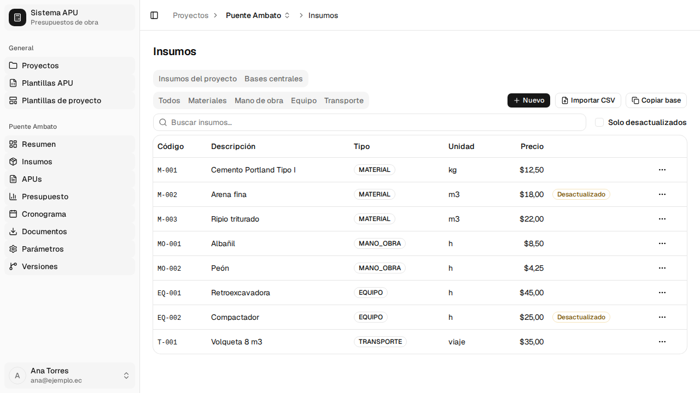
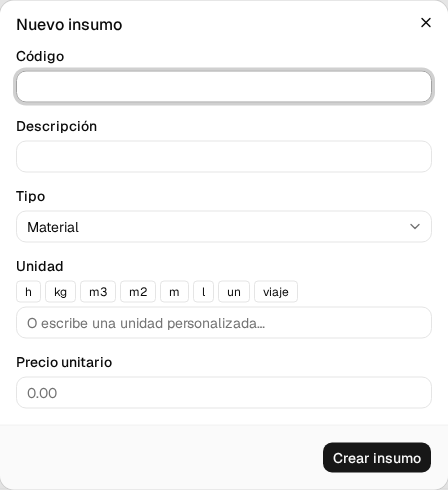
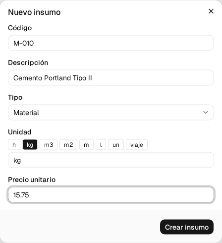
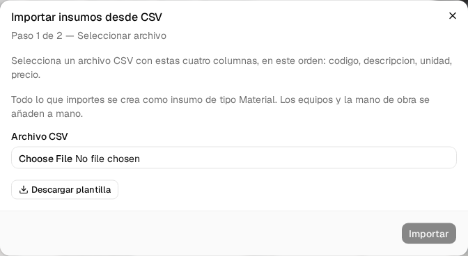
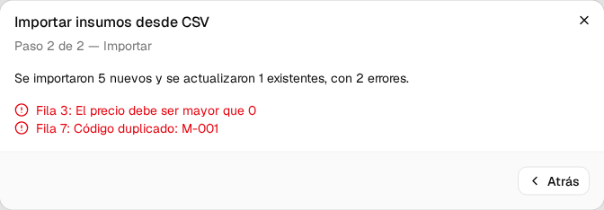
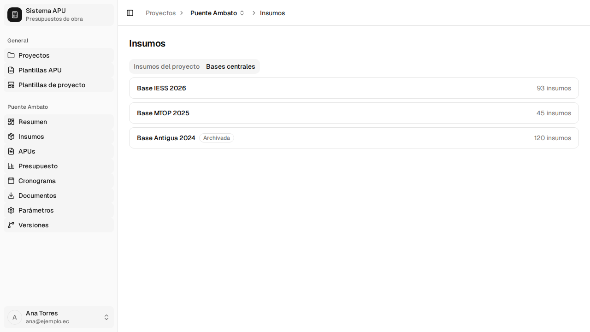
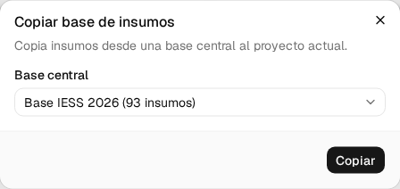

# 3. Insumos

Un **insumo** es cada material, jornal de mano de obra, tarifa de equipo o transporte con el que
se arma un análisis de precio unitario (APU). Este capítulo cubre cómo ver y filtrar el catálogo
de insumos de tu proyecto, cómo crearlos y editarlos uno a uno o en bloque por CSV, y cómo
partir de una base de insumos ya existente en vez de escribirla desde cero.

Procesos cubiertos: **P-13**, **P-14**, **P-15**, **P-16**, **P-17**.

---

## 3.1 Ver y filtrar los insumos del proyecto <!-- P-13 · S-14 -->

**Quién puede hacerlo:** cualquier usuario con sesión iniciada.

**Antes de empezar**

- Tener el proyecto abierto (ver §2.1).

**Pasos**

1. En el menú lateral del proyecto, entra en **Insumos**.

   

   La pestaña **Insumos del proyecto** muestra la tabla con **Código**, **Descripción**, **Tipo**,
   **Unidad** y **Precio**. Los insumos con precio desactualizado —más de tres meses sin
   actualizar— llevan la etiqueta **Desactualizado** junto al precio.

   

2. Usa las pestañas **Todos**, **Materiales**, **Mano de obra**, **Equipo** y **Transporte** para
   filtrar por tipo. Escribe en **Buscar insumos…** para buscar por código o descripción, o marca
   **Solo desactualizados** para ver solo los que tienen el precio antiguo.

**Si algo sale mal**

- _"No hay insumos — Agrega tu primer insumo para empezar."_ → todavía no has creado ningún
  insumo, ni copiado una base (§3.5) ni importado un archivo (§3.3).
- _"No se encontraron insumos con esos filtros."_ → borra el texto de búsqueda o cambia el
  filtro de tipo.

**Al terminar:** tienes la lista completa o filtrada de los insumos del proyecto, lista para
crear, editar o importar más.

---

## 3.2 Crear, editar y eliminar un insumo <!-- P-14 · S-15 -->

**Quién puede hacerlo:** cualquier usuario con sesión iniciada.

**Antes de empezar**

- Tener la pantalla **Insumos** abierta (§3.1).
- Si vas a cargar mano de obra o equipo, saber el jornal o la tarifa por hora ya calculados: el
  sistema no calcula costos horarios, solo guarda el valor final.

**Pasos**

1. Pulsa **Nuevo**.

   

   El diálogo abre con el tipo **Material** seleccionado por defecto.

   | Campo                                            | ¿Obligatorio?                   | Formato o valores                                                                                                                                                                 | Si lo dejas vacío o está mal                                      |
   | ------------------------------------------------ | ------------------------------- | --------------------------------------------------------------------------------------------------------------------------------------------------------------------------------- | ----------------------------------------------------------------- |
   | Código                                           | Sí                              | Texto                                                                                                                                                                             | _"El código es obligatorio"_ y no guarda                          |
   | Descripción                                      | Sí                              | Texto                                                                                                                                                                             | _"La descripción es obligatoria"_ y no guarda                     |
   | Tipo                                             | Sí                              | **Material** · **Mano de obra** · **Equipo** · **Transporte**                                                                                                                     | Viene con **Material** puesto                                     |
   | Unidad                                           | Sí, salvo mano de obra y equipo | **Mano de obra y Equipo:** fija en **h**, no se puede cambiar. **Material y Transporte:** elige entre las unidades rápidas (h, kg, m3, m2, m, l, un, viaje…) o escribe una propia | Para material o transporte, _"La unidad es obligatoria"_          |
   | Precio unitario / Jornal/hr / Tarifa/hr / Tarifa | Sí                              | Número mayor que 0                                                                                                                                                                | _"Ingresa un número válido"_ o _"El precio debe ser mayor que 0"_ |

   > La etiqueta de este último campo cambia con el tipo: **Jornal/hr** en mano de obra,
   > **Tarifa/hr** en equipo, **Tarifa** en transporte y **Precio unitario** en material.

   > Si escribes en **Unidad** algo que no está en la lista rápida, el sistema avisa _"Unidad no
   > común. Verifica que sea correcta."_, pero te deja continuar.

2. Elige el **Tipo**. Si eliges **Mano de obra** o **Equipo**, el campo **Unidad** se fija en
   **h** y deja de poder escribirse.

3. Completa el resto de campos y pulsa **Crear insumo**.

   

4. Para editar uno existente, pulsa **Editar** en el menú **⋯** de su fila. El diálogo abre con
   los mismos campos, pero **Código** y **Tipo** quedan bloqueados: no se pueden cambiar después
   de crear el insumo.

   > Cambiar el precio de un insumo se propaga de inmediato a todos los APUs que lo heredan —los
   > que no tienen su propio precio manual. Es el mecanismo con el que se ajustan costos.

5. Para eliminar uno, pulsa **Eliminar** en el menú **⋯** y confirma en el diálogo **Eliminar
   insumo**.

**Si algo sale mal**

- _"El código es obligatorio"_ / _"La descripción es obligatoria"_ / _"La unidad es
  obligatoria"_ → falta ese campo.
- _"Ingresa un número válido"_ → el precio no es un número.
- _"El precio debe ser mayor que 0"_ → el precio es cero o negativo.
- _"Código duplicado en esta base"_ → ya existe un insumo con ese código en el proyecto; usa
  otro.
- _"No se puede eliminar el insumo: está referenciado en N parte(s) de APU"_ → el insumo está en
  uso y el sistema bloquea el borrado (ver _Lo que todavía no está disponible_, más abajo).

**Al terminar:** el insumo queda creado, editado o eliminado en el catálogo del proyecto. Si
cambiaste un precio, los APUs que lo usan recalculan de inmediato.

---

## 3.3 Importar insumos por CSV <!-- P-15 · S-16 -->

**Quién puede hacerlo:** cualquier usuario con sesión iniciada.

**Antes de empezar**

- Tener listo un archivo CSV con exactamente cuatro columnas, en este orden: `codigo`,
  `descripcion`, `unidad`, `precio`.

**Pasos**

1. Pulsa **Importar CSV**.

   

   El asistente avisa: _"Todo lo que importes se crea como insumo de tipo Material. Los equipos
   y la mano de obra se añaden a mano."_ Si necesitas cargar mano de obra o equipo en bloque, no
   puedes hacerlo por este camino: agrégalos uno a uno (§3.2).

2. Si no tienes el archivo listo, pulsa **Descargar plantilla** para bajar un CSV de ejemplo con
   las columnas correctas.

3. Elige el archivo en **Archivo CSV** y pulsa **Importar**.

4. Si alguna fila tiene un problema, el asistente pasa a **Paso 2 de 2 — Importar** y las lista
   una por una, sin bloquear las que sí son válidas.

   

**Si algo sale mal** (mensajes literales, uno por fila)

- _"Código requerido"_ / _"Descripción requerida"_ → falta esa columna en esa fila.
- _"Código duplicado dentro del archivo"_ → dos filas del propio archivo usan el mismo código;
  corrígelo y vuelve a intentar.
- _"Precio no es un número válido"_ / _"Precio debe ser mayor a 0"_ → revisa la columna
  `precio` de esa fila.
- Para mano de obra o equipo, _"Para <TIPO> la unidad debe ser 'h'"_ → la columna `unidad` no
  trae `h`.

**Al terminar:** un aviso resume cuántas filas se crearon, cuántas se contaron como
actualizadas —si el código ya existía en el proyecto— y cuántas tuvieron errores. Las filas con
error no se importan; corrige el archivo y repite la importación.

---

## 3.4 Explorar las bases centrales <!-- P-16 · S-17 -->

**Quién puede hacerlo:** cualquier usuario con sesión iniciada.

**Pasos**

1. En **Insumos**, pulsa la pestaña **Bases centrales**.

   

   La vista muestra cada base con su nombre y el total de insumos que contiene. Las bases que ya
   no se actualizan llevan la etiqueta **Archivada**. Es una vista de solo consulta.

**Si algo sale mal**

- _"No hay bases centrales disponibles"_ → el administrador todavía no ha creado ninguna.

**Al terminar:** sabes qué bases existen y cuántos insumos trae cada una. Para usarlos en tu
proyecto, cópialos (§3.5).

---

## 3.5 Copiar una base al proyecto <!-- P-17 · S-18 -->

**Quién puede hacerlo:** cualquier usuario con sesión iniciada.

**Antes de empezar**

- Saber que copiar una base **no sobrescribe** lo que ya tienes: si un código coincide, se
  conserva el insumo que ya está en tu proyecto y el de la base se omite.

**Pasos**

1. En **Insumos**, pulsa **Copiar base**.

2. Elige la **Base central**.

   

3. Pulsa **Copiar**.

**Si algo sale mal**

- _"Error al copiar la base"_ → vuelve a intentarlo; si persiste, contacta a soporte.

**Al terminar:** el diálogo muestra cuántos insumos se copiaron y, si hubo códigos en conflicto,
la lista de los que se omitieron. La copia queda **completamente independiente** de la base
central: si el administrador cambia después un precio allí, tu proyecto no se entera.

---

## Lo que todavía no está disponible

- **Ver dónde se usa un insumo.** El menú **⋯** de cada fila tiene la opción **Ver uso**, pero
  hoy aparece siempre desactivada, con el mismo aviso que otras funciones sin backend
  (_"Disponible cuando el backend implemente esta operación."_). Mientras tanto, si intentas
  eliminar un insumo en uso, el aviso de error te dice **en cuántas** partes de APU está —pero
  no en cuáles.
- **Copiar desde un proyecto propio anterior.** El diálogo **Copiar base de insumos** solo
  ofrece bases centrales; no hay forma de elegir otro proyecto tuyo como fuente.
- **Un resumen de los insumos más usados con su costo**, en la propia pantalla de Insumos, no
  está disponible.
- **Dejar el código en blanco al crear un insumo** para que el sistema genere uno no funciona:
  el campo **Código** es obligatorio.
