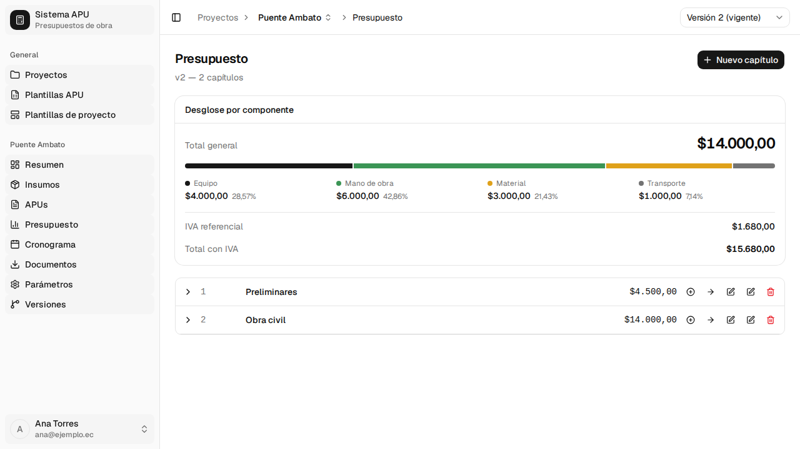
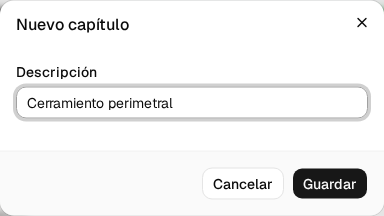
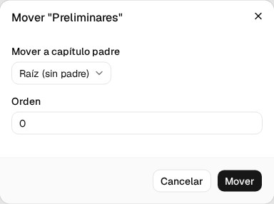
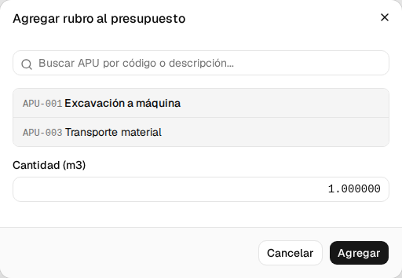
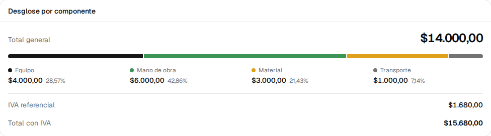
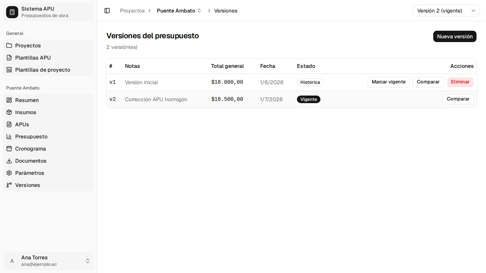
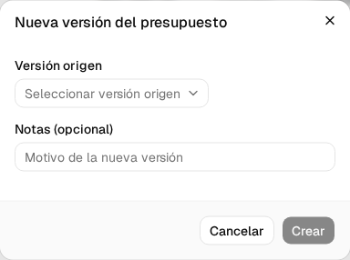
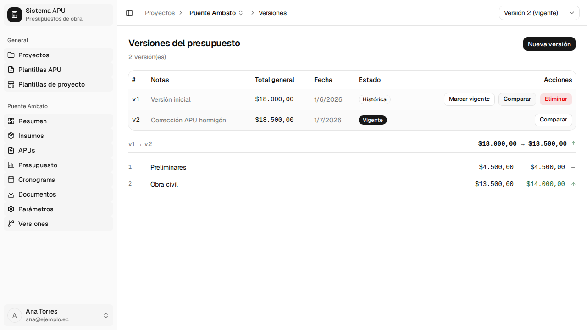
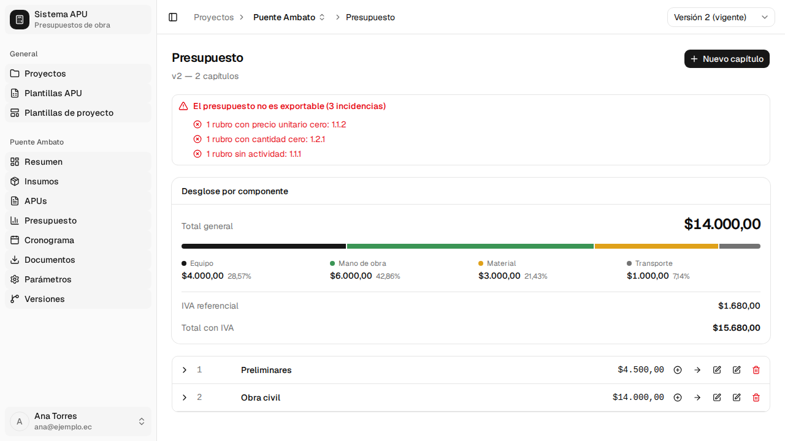
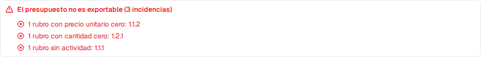

# 5. El presupuesto y sus versiones

El **presupuesto** es donde el trabajo se convierte en oferta: los ítems se organizan en
**capítulos**, cada ítem trae su cantidad de obra y su precio sale del **APU** que le corresponde
(ver §4). Este capítulo cubre cómo estructurar los capítulos, agregar ítems, leer los totales, y el
mecanismo de **versiones**, que te permite ajustar el precio sin perder la oferta anterior.

Procesos cubiertos: **P-28**, **P-29**, **P-30**, **P-31**, **P-32**.

Todo lo de este capítulo trabaja sobre **una** versión del presupuesto a la vez: la que muestra el
selector de la barra superior (**"Versión N"**, con **"(vigente)"** junto a la que está marcada como
tal). Cambiar de versión ahí cambia qué capítulos, ítems y totales ves y editas.

---

## 5.1 Estructurar capítulos <!-- P-28 · S-27, S-28 -->

**Quién puede hacerlo:** cualquier usuario con sesión iniciada.

**Antes de empezar**

- Tener el proyecto abierto y saber qué versión del presupuesto vas a editar (barra superior).

Los capítulos se organizan en árbol, **sin límite de niveles**: un capítulo puede tener
subcapítulos, y estos a su vez otros. La numeración (**1**, **1.1**, **1.1.1**...) **la pone el
sistema**; no hay ningún campo donde se escriba a mano.

**Pasos**

1. Entra en **Presupuesto**, en el menú lateral del proyecto.

   

   Cada fila de capítulo muestra su número, su descripción y su **total** (la suma de todo lo que
   contiene). El icono de la izquierda expande o contrae la fila si tiene subcapítulos o ítems.

2. Para un capítulo de primer nivel, pulsa **Nuevo capítulo**, arriba a la derecha. Para un
   subcapítulo dentro de uno existente, pulsa el icono **+** de "Agregar subcapítulo" en la fila
   del capítulo padre.

   

   | Campo       | ¿Obligatorio?                                    | Formato o valores | Si lo dejas vacío                      |
   | ----------- | ------------------------------------------------ | ----------------- | -------------------------------------- |
   | Descripción | Sí (el botón **Guardar** no se activa sin texto) | Texto libre       | El botón **Guardar** queda desactivado |

3. Pulsa **Guardar**. El capítulo aparece en el árbol con su número ya asignado.

4. Para editar la descripción de un capítulo, pulsa el icono de lápiz **"Editar descripción"** de
   su fila. Se abre el mismo diálogo con el texto actual, listo para cambiarlo.

5. Para mover un capítulo a otro lugar del árbol, pulsa el icono de lápiz **"Mover capítulo"** de
   su fila.

   

   | Campo                  | ¿Obligatorio? | Formato o valores                                                         | Si lo dejas vacío        |
   | ---------------------- | ------------- | ------------------------------------------------------------------------- | ------------------------ |
   | Mover a capítulo padre | No            | **Raíz (sin padre)** o cualquier otro capítulo, viene con **Raíz** puesto | Se queda en la raíz      |
   | Orden                  | No            | Número entero, viene con **0** puesto                                     | Se interpreta como **0** |

   Pulsa **Mover**. Toda la rama afectada se renumera sola.

   > **"Mover capítulo" y "Editar descripción" usan el mismo icono de lápiz** en la fila; solo se
   > distinguen por el texto que aparece al dejar el puntero encima. Si abriste el diálogo
   > equivocado, pulsa **Cancelar** y prueba con el otro icono.

6. Para eliminar un capítulo, pulsa el icono de papelera de su fila y confirma. **Se borran sus
   ítems**, pero **los APUs a los que apuntaban siguen existiendo** en la pantalla de APUs (§4): el
   ítem es solo el vínculo entre el capítulo y el APU, no el APU en sí.

**Si algo sale mal**

- El botón **Guardar** no se activa → falta escribir la descripción del capítulo.

**Al terminar:** el capítulo queda en el árbol con su numeración y, si tiene ítems o
subcapítulos, su total se calcula solo.

---

## 5.2 Agregar ítems al capítulo <!-- P-29 · S-29 -->

**Quién puede hacerlo:** cualquier usuario con sesión iniciada.

**Antes de empezar**

- Tener al menos un capítulo creado (§5.1).
- Tener el APU que vas a usar ya armado en **APUs** (§4). Un ítem toma su código, descripción,
  unidad y precio unitario directamente del APU: no se escriben a mano.

Un mismo APU **no se puede vincular dos veces en la misma versión**: una vez que lo agregas a un
capítulo, deja de aparecer en el buscador de este diálogo para esa versión.

**Pasos**

1. En la fila del capítulo, pulsa el icono de flecha **"Agregar rubro"**.

   

   | Campo                   | ¿Obligatorio?                                        | Formato o valores                               | Si lo dejas vacío                        |
   | ----------------------- | ---------------------------------------------------- | ----------------------------------------------- | ---------------------------------------- |
   | Buscar APU              | No                                                   | Texto; filtra la lista por código o descripción | Muestra todos los APUs disponibles       |
   | Rubro APU (de la lista) | Sí (el botón **Agregar** no se activa sin selección) | Elegir uno de la lista                          | El botón **Agregar** queda desactivado   |
   | Cantidad                | No hay validación en este diálogo                    | Texto; viene con **1.000000** puesto            | Se envía tal cual; el servidor la valida |

2. Toca un APU de la lista. Aparece el campo **Cantidad**, con la unidad del APU entre paréntesis
   (por ejemplo **Cantidad (m3)**).

3. Ajusta la cantidad y pulsa **Agregar**.

**Si algo sale mal**

- El botón **Agregar** no se activa → no has tocado ningún APU de la lista.
- _"Error al agregar rubro"_ → el servidor rechazó la cantidad (por ejemplo, si la dejaste en cero
  o negativa). El diálogo no marca el campo en rojo por sí mismo; corrige la cantidad y vuelve a
  intentar.

**Al terminar:** el ítem aparece en el capítulo con su código, descripción, unidad, precio unitario
y precio total (cantidad × precio unitario), y los totales del capítulo y del presupuesto se
recalculan. Para cambiar la cantidad más tarde, edítala directamente en su fila (columna
**Cantidad**) y sal del campo: se guarda al perder el foco, sin diálogo.

---

## 5.3 Totales y resumen por componente <!-- P-30 · S-27, S-30 -->

**Quién puede hacerlo:** cualquier usuario con sesión iniciada (es una vista de solo lectura).

**Antes de empezar**

- Tener capítulos e ítems cargados (§5.1, §5.2).

No hay nada que calcular a mano aquí: los totales se actualizan solos cada vez que cambias algo en
el presupuesto.

**Pasos**

1. En la pantalla **Presupuesto**, cada capítulo muestra su propio total a la derecha (ver la
   captura de §5.1). El total de un capítulo con subcapítulos es la suma de todos ellos.

2. Arriba del árbol, la tarjeta **Desglose por componente** reparte el costo entre **Equipo**,
   **Mano de obra**, **Material** y **Transporte**, cada uno con su monto y su porcentaje.

   

3. Debajo del desglose, **IVA referencial** y **Total con IVA** te dan una referencia con
   impuesto; el **Total general** de la tarjeta y el de la barra de capítulos **no llevan IVA**.

**Al terminar:** nada que confirmar — es una vista que se mantiene sola. Si acabas de agregar o
quitar un ítem y el total no parece haber cambiado, comprueba que sigues en la misma versión que
editaste (barra superior).

---

## 5.4 Versiones del presupuesto <!-- P-31 · S-31, S-32 -->

**Quién puede hacerlo:** cualquier usuario con sesión iniciada.

**Antes de empezar**

- Entender qué es una versión: **una foto completa** del presupuesto de ese momento —capítulos,
  ítems y los APUs que usan—. Crear una versión nueva copia todo eso; a partir de ahí, cada versión
  vive su vida aparte. Es lo que te deja bajar un precio sin perder la oferta con la que
  arrancaste.
- Saber que **solo una versión puede ser la vigente**: es la que resume la pantalla del proyecto y
  la que se exporta por defecto (§7) si no eliges otra a mano.

**Pasos**

1. En el menú lateral del proyecto, entra en **Versiones**.

   

   La tabla muestra el número de cada versión, sus notas, su **Total general**, la fecha y su
   estado: **Vigente** o **Histórica**.

2. Pulsa **Nueva versión**.

   

   | Campo            | ¿Obligatorio?                                      | Formato o valores                         | Si lo dejas vacío                    |
   | ---------------- | -------------------------------------------------- | ----------------------------------------- | ------------------------------------ |
   | Versión origen   | Sí (el botón **Crear** no se activa sin selección) | Elegir una versión existente del proyecto | El botón **Crear** queda desactivado |
   | Notas (opcional) | No                                                 | Texto libre; para anotar qué cambió       | Se queda vacía                       |

3. Elige de qué versión partir, anota qué vas a cambiar en **Notas** y pulsa **Crear**. La nueva
   versión copia todo el contenido de la de origen y nace **no vigente**.

   > **La barra superior no cambia sola a la versión recién creada.** Para verla y editarla,
   > selecciónala tú mismo en el selector de versión de la barra superior.

4. Ajusta la nueva versión (agrega o edita ítems, capítulos, precios de APU) sin tocar la anterior.

5. Para que una versión pase a ser la que se usa por defecto, pulsa **Marcar vigente** en su fila.
   Esto sí se refleja de inmediato en el selector de la barra superior.

6. Para comparar dos versiones, pulsa **Comparar** en la fila de la versión que quieres comparar
   con la vigente.

   

   La comparación aparece debajo de la tabla: el total general de cada versión y, fila por fila,
   el total de cada capítulo de primer nivel en ambas versiones, con una flecha que indica si subió,
   bajó o se quedó igual.

7. Para eliminar una versión que ya no necesitas, pulsa **Eliminar** en su fila y confirma. **La
   versión vigente no se puede eliminar** — primero marca otra como vigente.

**Si algo sale mal**

- El botón **Crear** no se activa → falta elegir la versión origen.
- Intentas eliminar la versión vigente → no verás el botón **Eliminar** en su fila: solo las
  versiones históricas lo muestran.
- Si el servidor rechaza el borrado de una versión, el aviso que aparece trae el motivo que manda
  el propio servidor; no hay un texto fijo en la pantalla para ese caso.

**Al terminar:** la versión queda creada, marcada vigente o eliminada según la acción. Solo hay
**una** vigente por proyecto en todo momento.

---

## 5.5 Alertas de integridad <!-- P-32 · S-27, S-35 -->

**Quién puede hacerlo:** nadie la activa a mano — el sistema la calcula sola a partir de tus datos.

**Antes de empezar**

- Ninguno; la alerta aparece o no según el estado real del presupuesto.

**Pasos**

1. Si algo en el presupuesto le impide ser exportable, un aviso aparece arriba del árbol, encima de
   **Desglose por componente**.

   

2. El aviso lista, por tipo, los ítems con problemas, citando su número de ítem (el mismo que ves
   en la fila del árbol):

   

   | Motivo                         | Qué significa                                                                                            |
   | ------------------------------ | -------------------------------------------------------------------------------------------------------- |
   | Rubro con precio unitario cero | El APU vinculado a ese ítem todavía no tiene costo (está sin terminar): ve a **APUs** (§4) y complétalo. |
   | Rubro con cantidad cero        | El ítem tiene cantidad de obra en cero.                                                                  |
   | Rubro sin actividad            | El ítem no tiene actividad asignada en el cronograma (§6).                                               |

3. Mientras el aviso esté presente, **Documentos → Exportar presupuesto** (§7) no deja generar el
   documento: el botón de descarga queda desactivado y la misma lista de ítems se repite ahí antes
   de exportar.

**Si algo sale mal**

- No encuentras la fila del ítem que menciona el aviso → expande los capítulos y subcapítulos del
  árbol hasta encontrar el número de ítem que cita el aviso (por ejemplo **1.1.2**).

**Al terminar:** nada que confirmar por tu parte. En cuanto arreglas el APU, la cantidad o la
actividad del ítem señalado, el aviso desaparece solo y la exportación queda disponible.

---

## Lo que todavía no está disponible

- **El árbol no marca la fila de cada ítem con problemas de forma individual.** La única señal de
  qué ítem falla es el número que cita el aviso de arriba (§5.5); no hay un icono ni un color en la
  fila del propio ítem dentro del árbol.
- **Crear una versión nueva no cambia la barra superior a la recién creada.** Tienes que
  seleccionarla tú mismo en el selector de versión, como se explica en §5.4.
- Los diálogos de este capítulo (**Nuevo capítulo**, **Mover capítulo**, **Agregar rubro**,
  **Nueva versión**) no marcan campos en rojo con un mensaje propio: si falta algo obligatorio,
  simplemente el botón de guardar no se activa.
