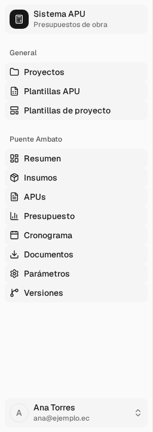
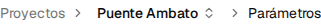
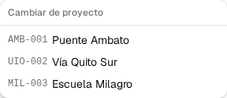
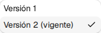
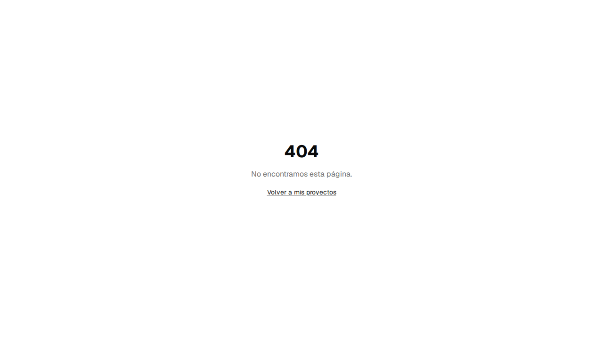
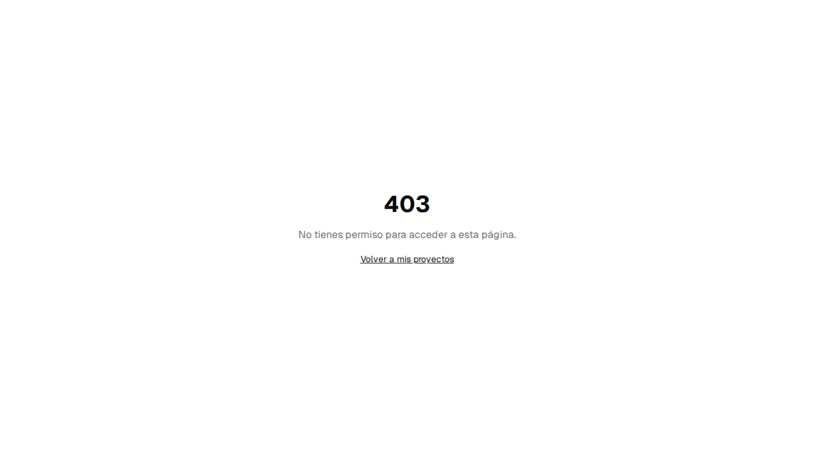
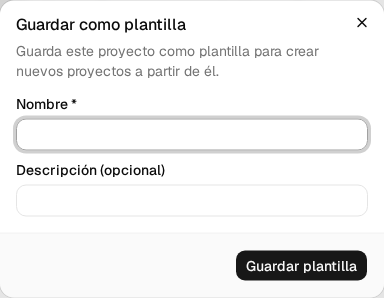
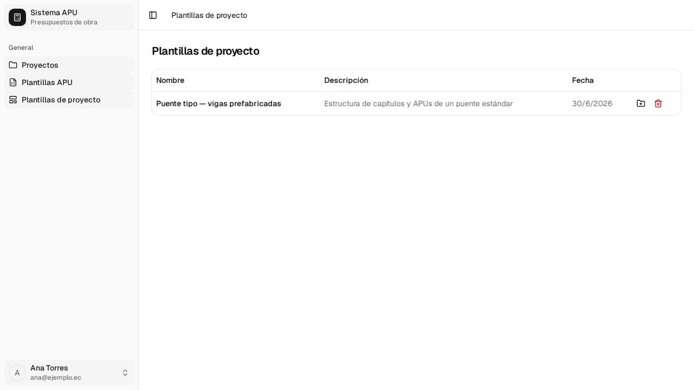

# 8. Moverse por la aplicación

Este capítulo explica el armazón que rodea todas las pantallas: el menú lateral, la barra
superior, cómo cambiar de proyecto y de versión, y qué significan los avisos y las páginas de
error que aparecen en cualquier parte. También cubre las **plantillas de proyecto completo**,
que te permiten reutilizar la estructura de un proyecto (capítulos, rubros y APUs) para arrancar
otro desde cero más rápido.

Procesos cubiertos: **P-43**, **P-44**, **P-46**.

---

## 8.1 El menú lateral y la barra superior <!-- P-43 · S-43 -->

**Quién puede hacerlo:** cualquier usuario con sesión iniciada.

**Antes de empezar**

- Tener la sesión iniciada (ver §1.2).

**Pasos**

1. El menú lateral tiene hasta tres secciones. Cuál ves depende de si tienes un proyecto abierto
   y de si eres administrador:

   | Sección                 | Cuándo aparece            | Qué contiene                                                                                                       |
   | ----------------------- | ------------------------- | ------------------------------------------------------------------------------------------------------------------ |
   | **General**             | Siempre                   | **Proyectos**, **Plantillas APU**, **Plantillas de proyecto**                                                      |
   | _(nombre del proyecto)_ | Con un proyecto abierto   | **Resumen**, **Insumos**, **APUs**, **Presupuesto**, **Cronograma**, **Documentos**, **Parámetros**, **Versiones** |
   | **Administración**      | Solo para administradores | Usuarios, Bases, Plantillas, Parámetros, Valores ref., Logs                                                        |

   

2. Con un proyecto abierto, el bloque de en medio lleva el **nombre del proyecto** como título y
   da acceso directo a sus ocho pantallas.

   

3. En la barra superior, el icono de la izquierda pliega y despliega el menú lateral. A su lado
   viven las **migas de pan**, que muestran dónde estás: **Proyectos › (proyecto) › (pantalla)**.

   

**Si algo sale mal**

- El menú lateral no muestra ningún proyecto en medio → todavía no has abierto uno; entra desde
  **Proyectos** (§2.1).

**Al terminar:** sabes en qué proyecto y en qué pantalla estás en todo momento, sin tener que
volver a Proyectos para orientarte.

> **Administración solo para administradores.** Varias de sus entradas —**Usuarios**,
> **Plantillas**, **Valores ref.** y **Logs**— aparecen atenuadas y, al pasar el ratón por
> encima, muestran _"Disponible cuando el backend implemente esta operación."_ **Bases** y
> **Parámetros** del sistema sí funcionan.

---

## 8.2 Cambiar de proyecto y de versión <!-- P-43 · S-43 -->

**Quién puede hacerlo:** cualquier usuario con sesión iniciada, dentro de un proyecto.

**Antes de empezar**

- Tener al menos dos proyectos o dos versiones para notar el cambio.

**Pasos**

1. En las migas de pan, pulsa el **nombre del proyecto**. Se despliega la lista de tus proyectos,
   con su código y su nombre.

   

2. Pulsa un proyecto de la lista para entrar en él. Sales del que tenías abierto.

3. En pantallas que trabajan sobre una versión del presupuesto (ver tabla de abajo), la barra
   superior muestra además el **selector de versión**, a la derecha. Pulsa para ver las versiones
   disponibles; la marca junto al nombre indica cuál es la **vigente**.

   

4. Elige una versión para verla. El cambio queda en la dirección web (parámetro `?v=`), así que
   puedes copiar el enlace y volver directamente a esa versión.

**Si algo sale mal**

- _"Sin versiones"_ en vez del selector → el proyecto todavía no tiene ninguna versión del
  presupuesto.

**Al terminar:** estás viendo el proyecto o la versión que elegiste. Solo tus propios proyectos
aparecen en el selector; los de otros usuarios no son accesibles ni por su dirección web (ver
§8.3).

### Qué depende de la versión y qué no

Esta es la confusión más común: **no todo lo que ves en un proyecto cambia cuando cambias de
versión.**

| Pantalla    | ¿Depende de la versión activa?               |
| ----------- | -------------------------------------------- |
| APUs        | Sí                                           |
| Presupuesto | Sí                                           |
| Cronograma  | Sí                                           |
| Documentos  | Sí                                           |
| Versiones   | Sí — es donde comparas y cambias entre ellas |
| Insumos     | No — es del proyecto entero                  |
| Parámetros  | No — es del proyecto entero                  |

Si cambias de versión y no ves tus datos, primero comprueba en qué versión estás: es la causa más
frecuente de "el sistema perdió mi trabajo", cuando en realidad sigue en la otra versión.

---

## 8.3 Estados, avisos y páginas de error <!-- P-44 · S-44 -->

**Quién puede hacerlo:** cualquier usuario; estos avisos son del sistema, no una acción que se
active a propósito.

Mientras usas la aplicación verás, según la pantalla:

- **Esqueletos de carga**: bloques grises con animación mientras llega la respuesta del servidor,
  en vez de una pantalla en blanco.
- **Estados vacíos con llamada a la acción**: por ejemplo _"No hay proyectos — Crea tu primer
  proyecto para empezar"_ (§2.1) o _"No tienes plantillas de proyecto — Guarda un proyecto como
  plantilla desde su página de resumen para verlo aquí"_ (§8.5).
- **Avisos de error o de éxito** (toasts) en la esquina, tras guardar, importar o exportar algo.
  Por ejemplo, al guardar una plantilla de proyecto: _"Plantilla guardada"_ si sale bien, o
  _"Error al guardar la plantilla"_ si falla.
- **Confirmación antes de cualquier acción que borra algo**, con el nombre de lo que vas a borrar
  y un botón **Eliminar** independiente del de **Cancelar** (ver el ejemplo completo en §2.5).

**Pasos para ver las páginas de error**

1. Si entras a una dirección que no existe, ves la página **404**.

   

2. Si intentas entrar a una pantalla de administración sin ser administrador, ves la página
   **403**.

   

3. Ambas llevan un enlace **Volver a mis proyectos**.

**Si algo sale mal**

- Un error inesperado en la aplicación (no un 404 ni un 403) muestra una pantalla con el título
  **Error**, el texto _"Ocurrió un error inesperado. Intenta de nuevo."_ y un botón
  **Reintentar**, que recarga la página.

**Al terminar:** sabes distinguir un **404** (la página no existe, o el recurso no es tuyo) de un
**403** (existe, pero no tienes el rol para verla).

> **Los proyectos de otro usuario dan «no encontrada», no «sin permiso».** Es a propósito: así
> nadie puede confirmar, por la respuesta de la página, si un proyecto ajeno existe o no.

---

## 8.4 Guardar un proyecto como plantilla <!-- P-46 · S-46 -->

Una **plantilla de proyecto** guarda la estructura de capítulos, rubros y APUs de un proyecto
—sin sus cantidades ni sus precios— para reutilizarla al crear otros proyectos parecidos.

**Quién puede hacerlo:** el dueño del proyecto.

**Antes de empezar**

- Tener el proyecto abierto, en la pantalla de resumen (§2.1).

**Pasos**

1. En el resumen del proyecto, abre el menú **⋯** (junto al botón **Editar**) y pulsa **Guardar
   como plantilla**.

2. Completa el diálogo.

   

   | Campo       | ¿Obligatorio? | Formato o valores | Si lo dejas vacío                           |
   | ----------- | ------------- | ----------------- | ------------------------------------------- |
   | Nombre      | Sí            | Texto libre       | _"El nombre es obligatorio"_ y no se guarda |
   | Descripción | No            | Texto libre       | Se guarda sin descripción                   |

3. Pulsa **Guardar plantilla**.

**Si algo sale mal**

- _"Error al guardar la plantilla"_ → inténtalo de nuevo; el proyecto no se modifica.

**Al terminar:** la plantilla queda disponible en **Plantillas de proyecto** (menú lateral,
sección General), con aviso _"Plantilla guardada"_. Guardar una plantilla **no cambia nada en el
proyecto** del que sale.

---

## 8.5 Listar y crear un proyecto desde una plantilla <!-- P-46 · S-46 -->

**Quién puede hacerlo:** cualquier usuario con sesión iniciada; solo ves tus propias plantillas.

**Antes de empezar**

- Tener al menos una plantilla guardada (§8.4).

**Pasos**

1. Entra en **Plantillas de proyecto**, en el menú lateral.

   

   La tabla muestra **Nombre**, **Descripción** y **Fecha**. Cada fila tiene dos acciones: el
   icono de carpeta (_"Crear proyecto desde esta plantilla"_) y el icono de papelera, que borra
   la plantilla tras confirmar —no afecta a los proyectos ya creados con ella.

2. Pulsa el icono de carpeta de la plantilla que quieras usar. Se abre un diálogo para elegir el
   nombre del nuevo proyecto.

   | Campo  | ¿Obligatorio? | Formato o valores | Si lo dejas vacío                                                 |
   | ------ | ------------- | ----------------- | ----------------------------------------------------------------- |
   | Nombre | Sí            | Texto libre       | El botón **Crear proyecto** no hace nada; no aparece ningún aviso |

3. Escribe el nombre y pulsa **Crear proyecto**.

**Si algo sale mal**

- _"Error al crear el proyecto"_ → inténtalo de nuevo.

**Al terminar:** entras directo al nuevo proyecto, con el aviso _"Proyecto creado desde la
plantilla"_. Tiene la misma estructura de capítulos, rubros y APUs que la plantilla, pero:

- **Las cantidades de obra de cada rubro vienen en cero.** Complétalas tú en Presupuesto (§5).
- **Los precios que el sistema no pudo resolver contra tu base de insumos también quedan en
  cero**, con un aviso. No es que algo haya fallado: es que ese insumo no existe en tu base y te
  toca fijarle un precio (ver §3, Insumos).

---

## Lo que todavía no está disponible

- En **Administración**, las entradas **Usuarios**, **Plantillas**, **Valores ref.** y **Logs**
  aparecen en el menú pero desactivadas, con el aviso _"Disponible cuando el backend implemente
  esta operación."_ **Bases** y **Parámetros** del sistema sí están operativas.
- **Duplicar un proyecto** no aparece en el menú porque el backend no expone esa operación; para
  reutilizar la estructura usa las plantillas de este capítulo.
